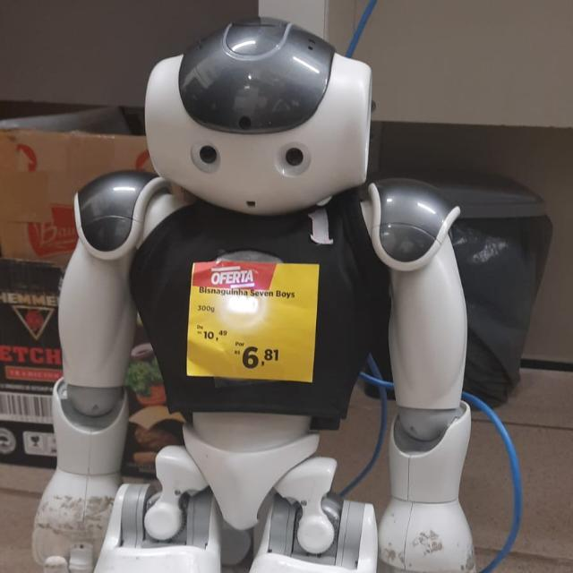

# Documentação do Tamboerijn

*Disclaimer: This docs are based on the original documentation written by the HULKs team, it has some parts adapted to our team's needs*

## Sobre
Este respositório tem como objetivo documentar o codebase Tamboerijn, que consiste na adaptação do code realease da equipe alemã HULKs. Ele contém partes traduzidas do inglês para o português, além de algumas adaptações feitas pela equipe para suprir nossos interesses e necessidades internas.

Ele está sob a licensa GPU 3.0, que pode ser encontrada [aqui](./LICENSE), assim como o repositório original da equipe HULKs, que pode ser encontrado [aqui](https://github.com/HULKs/hulk).

Todas as pastas abordam um tópico específico do codebase, e contém um arquivo `README.md` com informações sobre o tópico.

É uma boa prática que todos os membros da categoria leiam este documento para entender o funcionamento do codebase, assim como atualizar este documento conforme novas atualizações forem sendo implementadas.

Qualquer dúvida sobre o funcionamento do codebase pode ser tirada com os membros da equipe, ou deixando uma issue do [repositório oficial](https://github.com/rinobot-team/Tamboerijn). Qualquer problema com a tradução, adaptação ou redação do documento pode ser reportado diretamente neste repositório.

## Índice e Status

| Tópico | Status |
| ------ | ------ |
| Configuração do Projeto  | Incompleto |
| Framework | Incompleto |
| Ferramental | Incompleto |
| Sistema Operacional | Não existe |
| Robótica | Não existe |
| Workflow | Não existe |