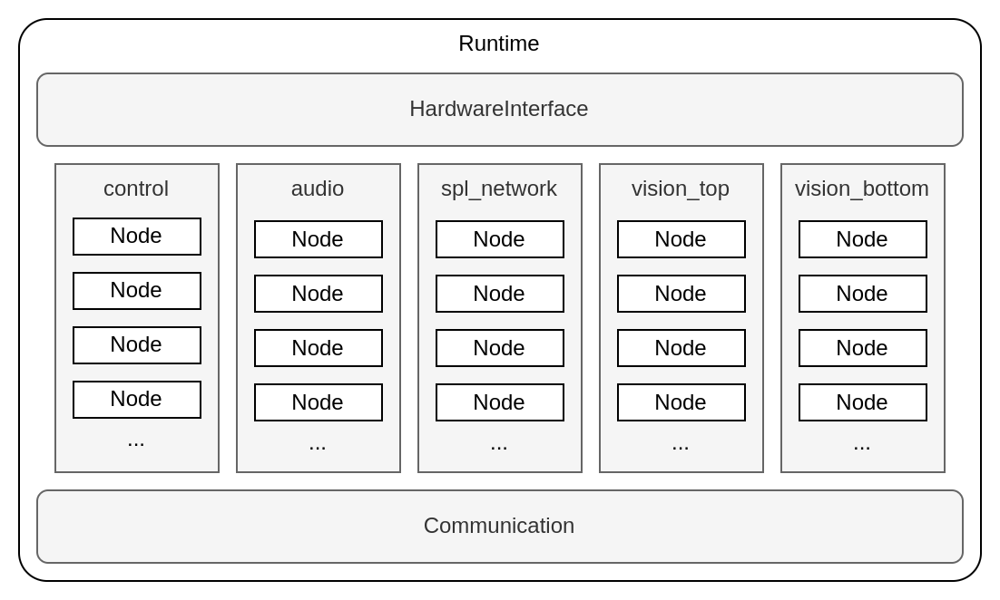

# Sobre
Esse tópico aborda a framework do nosso software para o NAO. Os capítulos passam por diversos aspectos numa abordagem "de cima para baixo" com uma visão geral, depois detalhando cada parte do sistema. Aqui está uma lista dos capítulos:  
    - [Estrutura de diretórios](./directory-struct.md): Explica a estutura de pastas do repositorio.   
    - [Entry Point](./entry-point.md): Inicia a abordagem top-down do sistema, explicando o ponto de entrada do programa na função `main`.   
    - [Runtime](./runtime.md): Como a runtime faz a conexão entre os módulos do sistema?   
    - [Cyclers](./cyclers.md): O que são os cyclers (ciclos de execução) e como eles rodam os diferentes nós?   
    - [Nós](./nodes.md): O que são os nós e como eles são implementados?   
    - [Bases de dados e Tipos](./databases-types.md): Como os dados são compartilhados entre cyclers e a framework?   
    - [Parâmetros](./parameters.md): Como os parâmetros são passados para os nós pela framework?   
    - [Comunicação](./communication.md): Do que se trata e como é feita a comunicação entre framework e nós?   
    - [Interface com Hardware](hardware-interface.md): Como o hardware é abstraído para a framework?   
    - [Comunicação entre threads](./thread-communication.md): Quais conceitos existem para permitir uma comunicação thread-safe entre os subcomponentes?   
    - [Filtragem](./filtering.md): Como a filtragem de dados é feita na framework e como ela se comporta num software multi-thread?   
    - [Macros](./macros.md): Quais macros são usadas para facilitar o desenvolvimento e como eles funcionam?   
    - [Tratamento de erros](./error-handling.md): Como a framework lida com erros e exceções, e como devo implementar?   

A framework provê os principais aspectos necessários para o desenvolvimento de um software para o NAO. Ele tem uma arquitetura modular que permite facil desenvolvimento e substituição de nós. A framework consiste de quatro componentes fundamentais:   
    - [Runtime](./runtime.md): Encapsula todos os subcomponentes, instanciando e inicializando eles.      
    - [Interface com Hardware](hardware-interface.md): Abstrai o hardware do NAO, permitindo a comunicação com os sensores e atuadores.   
    - [Cyclers](./cyclers.md): Cicla entre os nós, processa dados do hardware e gera saídas.   
    - [Comunicação](./communication.md): Permite a comunicação entre o framework e outros recursos, como arquivos, nós e redes.

