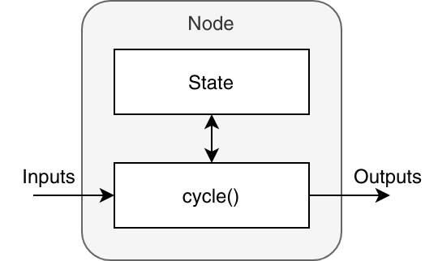

# Nodes (Nós)
Os Nós normalmente contém código de robótica propriamente dito e são intercambiáveis entre cyclers. Cada nó é caracterizado po uma função `cycle()` que é chamada em cada ciclo. Essa função pega os inputs do nó como parâmetros e retorna os outputs deste node. Além disso, nós possuem um estado que é preservado entre ciclos.



Nós são structs normais do Rust em que os campos da struct representam o estado, e um método chamado `cycle()` no `impl` do nó que representa a função de ciclo. Esse conceito permite escrever os nós na forma mais otimizada para a linguagem Rust. Um nó pode ter multiplos inputs de diferentes tipos que podem ser adicionados ao struct. Aqui está um exemplo de nó, mais informação pode ser encontrada em [Macros](./macros.md):   

```rust
pub struct SolePressureFilter { // (1)
    left_sole_pressure: LowPassFilter<f32>,
    right_sole_pressure: LowPassFilter<f32>,
}

#[node(control)] // (2)
#[parameter(path = low_pass_alpha, data_type = f32)] // (3)
#[input(path = sensor_data, data_type = SensorData)] // (4)
#[main_output(data_type = SolePressure)] // (5)
impl SolePressureFilter {} // (6)

impl SolePressureFilter {
    fn new(context: NewContext) -> anyhow::Result<Self> { // (7)
        Ok(Self {
            left_sole_pressure: LowPassFilter::with_alpha(
                0.0,
                *context.low_pass_alpha, // (8)
            ),
            right_sole_pressure: LowPassFilter::with_alpha(
                0.0,
                *context.low_pass_alpha,
            ),
        })
    }

    fn cycle(&mut self, context: CycleContext) -> anyhow::Result<MainOutputs> { // (9)
        let force_sensitive_resistors =
            &require_some!(context.sensor_data).force_sensitive_resistors;

        let left_sole_pressure = force_sensitive_resistors.left.sum();
        self.left_sole_pressure.update(left_sole_pressure);
        let right_sole_pressure = force_sensitive_resistors.right.sum();
        self.right_sole_pressure.update(right_sole_pressure);

        Ok(MainOutputs {
            sole_pressure: Some(SolePressure {
                left: self.left_sole_pressure.state(),
                right: self.right_sole_pressure.state(),
            }),
        })
    }
}
```

1. Estados do nó.
2. Declaração do nó utilizando o [macro](./macros.md) `node`.
3. Parâmetros de configuração do tipo `f32`.
4. Inputs do tipo `SensorData`.
5. Output do tipo `SolePressure`.
6. O `impl` vazio facilita a utilização de *language servers* e *code linters*. Se a declaração do nó estivesse em conjunto com o `impl` abaixo os macros iriam produzir inúmeros erros enquando o código estivesse sendo construído. Isso acontece com frequencia implementando códigos de nó.
7. É chamado na construição do nó.
8. Usa os parâmetros de configuração declarados. Como é uma referência, o valor é desreferenciado com `*`.
9. Chamado a cada ciclo.

Esse nó consome o tipo `SensorData` como entrada e produz uma saída do tipo `SolePressure`. E possui duas variáveis de estado, `left_sole_pressure` e `right_sole_pressure`. E é responsável por abstrair os dados vindos dos sensores de pressão localizado nas solas dos pés do robô.

Essa especificação de inputs e outputs do nó acarreta em grafo de dependências que permite organizar eles topológicamente, se todas as dependências forem satisfeitas antes de executar o `cycle()` de cada node. O arquivo `build.rs` automaticamente ordena os nós baseado nesse grafo.

