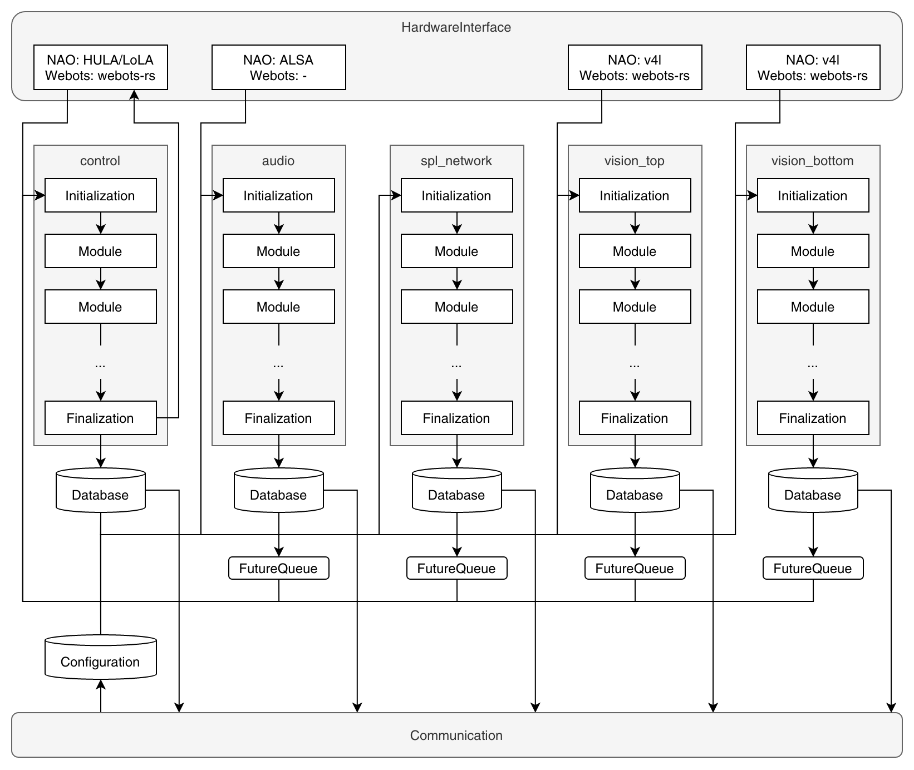

# Runtime
O Runtime, ou tempo de execução, é o componente do software que encapsula todos os subcomponentes, como interface de hardware, comunicação, e execução de nós. Aqui está uma imagem mais detalhada do que o Runtime faz:   

Essa seção e as subsequentes vão explicar esse diagrama com mais detalhes. Muitas conexões do fluxo de dados não estão representadas para facilitar a compreensão da imagem.

O Runtime é construído com uma interface de hardware já criada e inicializada pelo código. Ela contém todos os subcomponentes e por isso é responsável por construir e inicializar eles. Subcomponentes precisam ser interconectados entre si. Dessa forma, o runtime cria todos os canais de comunicação necessários, além dos buffers que são compartilhados entre os subcomponentes. Mais detalhes sobre comunicação enter cyclers e comunicação no geral são fornecidas em [Comunicação](./communication.md).