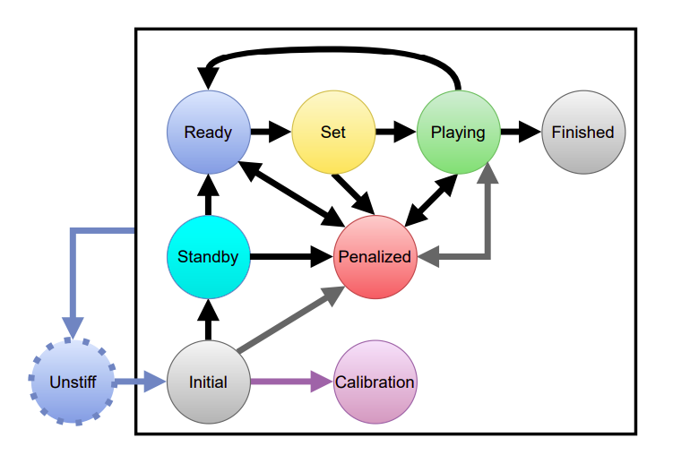

# Estados do Robô

Pelo *rulebook* do SPL, o robô pode assumir 9 *estados primários* diferentes (veja o diagrama abaixo). Deve haver conexão WiFi para que os estados sejam alterados pelo Game Controller. E cabe à área de comportamento e estratégia do time implementar a lógica de resposta ao Game Controller e a transição de estados propriamente dita no NAO.

## Diagrama de Estados

  

- As setas cinzas representam a transição de estados que é feita pelo botão do peito do robô. Porém, todos os estados podem ser mudados pelo Game Controller.  
- As setas pretas representam a transição de estados que é feita somente pelo Game Controller.  
- A seta azul mostra que qualquer estado pode ser transicionado para `unstiff`.  
- A seta roxa mostra que somente o estado `initial` pode ser transicionado para `calibration`.  

## Estados Primários

Este tópico descreve os estados primários do robô, a principal lógica delas e as regras que os regem.

Os estados primários ditados pela Robocup são estes abaixo. Importante ressaltar que o LED do botão do peito deve mudar de cor indicando o estado atual do robô.

1. **`unstiff`**: *Não rígido*, estado em que todos os motores estão ligados, mas sem nenhuma rigidez. O robô deve retornar à posição sentado e com as juntas relaxadas. Deve ser feito quando os 3 sensores de toque da cabeça são pressionados simultaneamente. Neste estado, os LEDs do peito devem estar piscando azuis.
2. **`initial`**: *Inicial*, os robôs estão livres para se mover de acordo com a vontade do time, e humanos podem interagir com eles. Neste estado, não há limite de tempo, e os times têm acesso ao campo. O Game Controller vai ativar este estado antes do `standby`. Apertar o botão do peito deve trocar de estado para `penalized`. Os LEDs devem estar desligados.
3. **`standby`**: *Em espera*, os robôs não podem se mover em qualquer modo, exceto para se levantar e mexer a cabeça. Neste estado, os robôs estão esperando um sinal visual do juiz para começar o jogo. **Este estado só é usado na Champions Cup, e nós, da Challengers Shield, não precisamos de nos preocupar por enquanto**. Para nós o robô pula para o estado `ready`. Os LEDs devem estar fixo em ciano.
4. **`ready`**: *Pronto*, os robôs devem andar até suas posições legais para o chute inicial ou cobrança de pênalti. Eles permanecem neste estado até que o juiz principal dê o sinal para começar o jogo ou até 45 segundos se passarem (30 segundos em caso de pênalti). LEDs fixos em azul.
5. **`set`**: *Preparado*. Neste estado, os robôs param e esperam pelo chute inicial ou cobrança de pênalti. Robôs em posição ilegal são penalizados (estado deve mudar para `penalized`) e colocados na borda do campo. Os jogadores podem se mover para se levantar caso caiam no caminho para a posição correta. Porém, não podem se locomover de outra maneira. Caso não se levantem, serão retirados do campo. LEDs devem estar fixos em amarelo.
6. **`playing`**: *Jogando*. Os robôs estão jogando a partida. Apertar o peito deve transicionar para `penalized`.LEDs devem estar fixos em verde.  
7. **`penalized`**: *Penalizado*. O robô foi penalizado e deve ficar parado por um tempo determinado pelo juiz. Os únicos movimentos permitidos são os responsáveis por levantar o robô em caso de queda. Qualquer outro movimento, inclusive mexer a cabeça, são ilegais. Apertar o peito novamente deve retornar ao estado de `playing`. LEDs devem estar fixos em vermelho.
8. **`finished`**: *Finalizado*. Quando um tempo de jogo ou a partida termina. Comportamento não especificado. LEDs devem estar desligados.
9. **`calibration`**: *Calibração*. Estado em que o robô está calibrando seus sensores. Deve ser disponivel para a transição apenas se o estado atual for `initial`. Deve ser acessado apertando o botão frontal da cabeça. LEDs devem estar fixos em roxo.

Alguns estados podem ser transicionados a partir de apitos do juiz. Conferir o livro de regras para ver quais e como se aplicam, pois é comum mudarem.