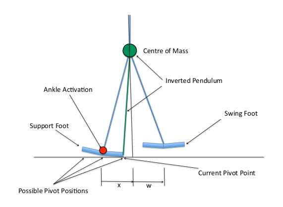

# Planejamento de Passos

O planejamento de passos gira em torno do motor de caminhada desenvolvido pelo [Bernhard Hengst](https://www.researchgate.net/profile/Bernhard-Hengst) da [UNSW Sydney](https://www.unsw.edu.au/), que se tornou padrão da liga e é um dos principais avanços na robótica bipedal.

O documento base na íntegra pode ser encontrado [aqui](https://www.researchgate.net/publication/220718598_Learning_ankle-tilt_and_foot-placement_control_for_flat-footed_bipedal_balancing_and_walking) e uma continuação [aqui](https://www.researchgate.net/publication/265625048_Learning_to_Control_a_Biped_with_Feet). Esses artigos são bem técnicos, é onde o filho chora e a mãe não vê.

Este documento apresenda, de forma simplificada, o processo de planejamento de passos.

## Metodologia

### 1: Modelo de simulação

- O robô bípede é modelado como um pêndulo invertido.
- Variáveis de estado: Deslocamento horizontal (`x`), velocidade horizontal (`x'`), posição do pé oscilante (`w`) e tempo de ciclo de caminhada (`t`).
- Ações de controle: inclinação do tornozelo (posição do pivô no pé de suporte) e deslocamento incremental do pé oscilante.

### 2: Planejamento de passos

Fomalização via Processo de Decisão de Markov ([MDP](https://medium.com/turing-talks/aprendizado-por-refor%C3%A7o-2-processo-de-decis%C3%A3o-de-markov-mdp-parte-1-84e69e05f007)): (S, A, T, R), onde:

- `S`: conjunto de estados.
- `A`: conjunto de ações.
- `T`: função de transição estocástica.
- `R`: função de recompensa.

Uso de [Q-Learning](https://www.freecodecamp.org/portuguese/news/uma-introducao-ao-q-learning-aprendizagem-com-reforco/) para aprendizado de reforço com fator de desconto `γ = 0.9` e taxa de aprendizado `α = 0.05`.

Recompensa `R` é dada por:

- *-1000* para estados fora dos limites permitidos.
- *+1000* para alcançar o objetivo.
- *-1 ou -10* para penalizar ações que movimentam motores.

Estado estimado via filtro de Kalman utilizando os sensores de pressão dos pés, [IMU](https://electronics.jf-parede.pt/imu-sensor-working-its-applications) e encoder dos motores.

#### É importante levar em consideração que este modelo não considera movimentos coronais (laterais). Ainda não encontrei como eles são modelados

## Implementação

No Tamboerijn, o módulo `walking_engine` da crate `control/motion` coordena e controla a movimentação de andar, com base no modelo de simulação descrito acima, adicionando também a lógica de movimentação dos braços e ajustes de equilíbrio e chutes.

Aqui estão os principais módulos e suas responsabilidades:

### `engine.rs`

Define funções principais de cálculo, como `calculate_foot_to_robot`, para obter transformações dos pés no espaço do robô. Inclui funções matemáticas (ex.: `parabolic_return` e `parabolic_step`) que ajudam a modelar a característica parabólica do movimento.

### `arms.rs`

Gerencia a lógica de movimentação dos braços, com estados de **Swing**, **PullingBack**, **PullingTight**, etc. Usa interpoladores (`SplineInterpolator`, `TimedSpline`) para transições suaves entre posturas (ex.: `pull_back_joints` e `pull_tight_joints`).

### `walk_state.rs`

Define a máquina de estados da caminhada (**Standing**, **Starting**, **Walking**, **Kicking**, etc.).
A evolução de cada estado depende do comando recebido (`Stand`, `Walk`, `Kick`) e do pé de suporte (`Side`).

### `kicking.rs`

Aplica ajustes nos ângulos das pernas para executar o chute (`apply_joint_overrides`).
Uso de **JointOverride** para interpolar valores conforme o tempo e a intensidade do chute.

### `foot_offsets.rs`

Estrutura que guarda os offsets (compensações) de cada pé (`forward`, `left`). Fornece métodos utilitários como `FootOffsets::zero()`. É necessário por que todo o equilíbrio e modelo do robô é baseado no centro de massa, mas para realizar o movimento dos pés é necessário deslocar o ponto de referência.

### `balancing.rs`

Implementa correções de equilíbrio, como `support_leg_gyro_balancing`, ajustando articulações do pé/tornozelo/quadril com base em medições de giroscópio. Inclui lógica de ajuste de passo (como `step_adjustment`) que corrige a posição dos pés conforme o deslocamento do tronco.
