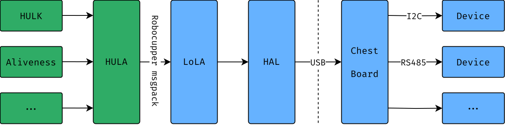

# HUlks Level Abstraction (HULA)

O HULA é uma camada de abstração que conecta o LoLA (Low Level Abstraction) padrão da Aldebaran e serve de interface para nossas aplicações. Diferente do LoLA, o HULA suporta múltiplos clients simultâneos.



## No NAO

No NAO, o [systemd](https://systemd.io/) gerencia o `hula.service`. Ele pode ser iniciado, parado e reiniciado com os comandos padrão do systemd:

```bash
systemctl start hula
systemctl stop hula
systemctl restart hula
```

## Buildar

Embora já venha compilada na imagem, caso seja necessário, para buildar o HULA:

1. Forneça a source do SDK com o comando `. naosdk/<version>/environment-setup-corei7-64-aldebaran-linux`. Certifique-se de usar uma shell padrão POSIX, como o bash.  
2. Rode `cargo build --manifest-path tools/hula/Cargo.toml` para compilar o binário.  
3. Copie o binário compilado da pasta `hula/target` para o NAO com o comando `scp <imagem> <endereco ssh do nao:home/>`.  
4. Conecte no NAO via SSH: `ssh nao@<endereco ssh do nao>` ou `pepsi shell <endereco>`.  
5. Pare o serviço HULA que provavelmente está rodando: `systemctl stop hula`.
6. Execute o binário copiado: `./hula`.  
7. Seja feliz.  
