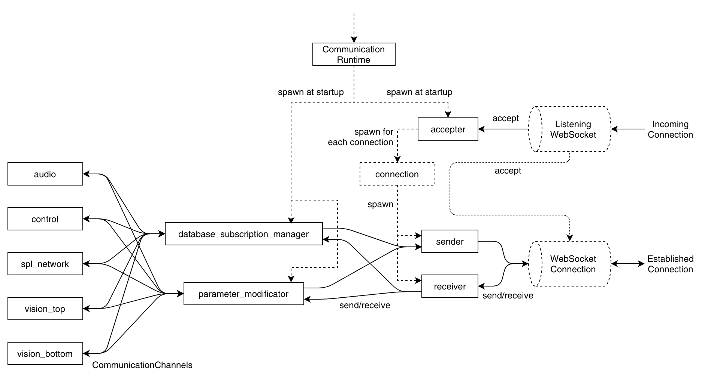

# Comunicação
A Comunicação é o subcomponente da framework que faz os [cyclers](./cyclers.md) auditáveis para o mundo externo. Ao passo que os cyclers necessitam rodar em tempo real, a comunicação não tem esse requerimento. Já que ela lida com I/O externo e aplicações conectadas através da rede, que podem influenciar na performance e responsividade, a comunicação apresenta toda suas funcionalidades em um método de melhor esforço (best-effort), e, dessa forma, retira essa responsabilidade dos cyclers.

Em um alto nível, a comunicação permite aplicações externas à:   
- Inscrever-se em databases de cyclers e receber campos selecionados delas (`database_subscription_manager`)
- Inscrever-se em parâmetros de configuração, receber modificados e atualizá-los (`parameter_modification`)

## Canais Assíncronos e Tasks
Já que a comunicação lida com I/O (entrada e saída de dados) e está inativo a maior parte do tempo esperando por esse I/O, ela é implementada como um subcomponente assíncrono (usando a [crate Tokio do Rust](https://tokio.rs/)) utilizando o paradigma de [message passing](https://en.wikipedia.org/wiki/Message_passing). As partes da comunicação são executadas como tasks (tarefas) assíncronas que são conectadas via canais de passagem de mensagem. O seguinte diagrama mostra todas as tasks de comunicação como caixas retangulares (exceto as threads dos cyclers, que podem ou não ser vistas como tasks):

Conexões sólidas representam fluxos de dados implementados com canais. Conexões tracejadas representam o comportamento de inicialização de tasks.

## Criação de Tasks e Gerenciamento de Conexões

O ponto de entrada é o Runtime de Comunicação, que se trata de uma thread rodando o [Runtime Assíncrono do Tokio](https://tokio.rs/tokio/tutorial/async). Essa thread é iniciada a partir do [Runtime da framework](./runtime.md), similarmente ao runtime dos cyclers. O runtime de comunicação da origem à novas tasks e conecta ela por canais:
- `accepter` task: Escuta por novas conexões no socket e instancia uma nova `connection` task para cada conexão aceita
- `connection` task: É uma task de curta vida que divide a conexão com o socket entre uma metade receptora e uma emissora e cria duas novas tasks de vida longa, uma `sender` e uma `receiver`. Essa cisão permite que estas tasks de longa vida se comportem como tasks de multiplexing e desmultiplexing.
    - `sender` task: Reune todas as mensagens das tasks conectadas e as envia para o socket.
    - `receiver` task: Interpreta mensagens vindas do socket e as encaminha para a task de processamento adequada (`database_subscription_manager` ou `parameter_modification`).

## Inscrições de Database
A comunicação permite que os clientes conectados se inscrevam nos cyclers e recebam campos selecionados de suas databases. Inscrições são gerenciadas na task `database_subscription_manager`. A task `receiver` é responsável por encaminhar requisições de (des)incrição do client à  `database_subscription_manager`. Se a conexão for fechada, o `receiver` manda uma requisição de `UnsubscribeEverything` ao gerente da task. Já que toda interação entre tasks ocorre via canais, em algumas requisições é necessário incluir os endpoints de outros canais (como o retorno de resultados por exemplo). Inscrições sempre contém um [cycler](./cyclers.md), tipo de saída e caminho dos dados. Se os cyclers completarem sua execução de todos os módulos internos a database é completada e liberada. Depois, o cycler notifica com uma requisição de `Notify` que é compartilhada entre cycler e o `database_subscription_manager` na comunicação. Isso permite que o gerenciador espere por novas databases disponíveis de qualquer cycler. Quando uma nova database é disponibilizada, a task gerente itera sobre todas as incrições relevantes e extrai tipos e imagens inscritas para construir mensagens para os clients inscritos. Saídas adicionais que podem estar inscritas são direcionadas ao cycler para que ele instrua os módulos a gerarem as saídas adicionais.

## Inscrição de Parâmetros e Atualizações
A Comunicação permite que os clientes conectados se inscrevam em parâmetros de configuração, receba modificados e os atualize. De forma análoga às inscrições de database, inscrições de parâmetros são processadas pela task `receiver`.

**TODO**:
- WebSocket e Protocolos / JSON (De)Serialização
    - Acceptor
    - Inicialização do socket (handshake)
    - Sender / Receiver
    - Formato das mensagens